# 第四章：项目 4 - 游戏

应用商店上大多数成功的应用都是游戏。它们被证明非常受欢迎，因为移动用户倾向于在通勤、候诊室、旅行或者在家休息时玩各种类型的游戏。事实上，移动用户更倾向于为游戏付费，而不是市场上的其他类型的应用，因为大多数时候它们的感知价值更高。

现代游戏通常是使用强大的游戏引擎构建的，比如 Unity 或 Unreal，因为它们提供了一系列工具和框架来处理精灵、动画或物理效果。但事实是，由于其原生能力，React Native 也可以构建出优秀的游戏。此外，React Native 已经将许多网页和移动应用程序员引入游戏开发，因为它为他们提供了熟悉和直观的界面。当构建游戏时，非游戏开发人员可能需要理解一些游戏开发的概念，以充分利用库的优势。像精灵、滴答声或碰撞这样的概念是非游戏开发人员在构建游戏之前可能需要克服的小障碍。

游戏将为 iOS 和 Android 构建，并将使用有限数量的外部库。选择了 Redux 作为状态管理库，以帮助计算每一帧上每个精灵的位置。

我们将使用一些自定义精灵，并添加声音效果以提醒每次得分增加。构建游戏时的主要挑战之一是确保精灵能够响应式地渲染，以便不同设备以相同的比例显示游戏，从而在不同的屏幕尺寸上提供相同的游戏体验。

这款游戏将设计为仅支持竖屏模式。

# 概述

我们在这节课中要构建的游戏具有简单的机制：

+   目标是帮助一只鹦鹉在洞穴中飞过岩石

+   点击屏幕会使鹦鹉飞得更高

+   重力会把鹦鹉拉向地面

+   鹦鹉与岩石或地面之间的任何碰撞都将导致游戏结束

+   每次鹦鹉飞过一组岩石时，得分将增加

这种类型的游戏非常适合使用 React Native 构建，因为它实际上不需要复杂的动画或物理能力。我们只需要确保在正确的时间移动屏幕上的每个精灵（图形组件），以创建连续动画的感觉。

让我们来看一下我们游戏的初始屏幕：

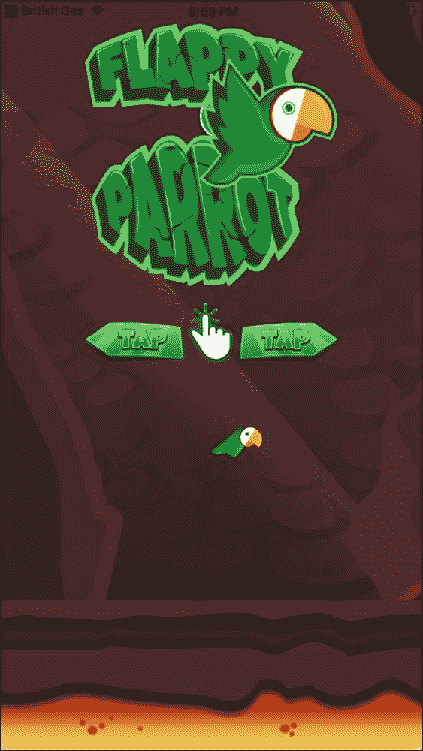

这个屏幕展示了游戏的标志和关于如何启动游戏的说明。在这种情况下，简单的轻触将启动游戏机制，导致鹦鹉在每次轻触时向前飞行。

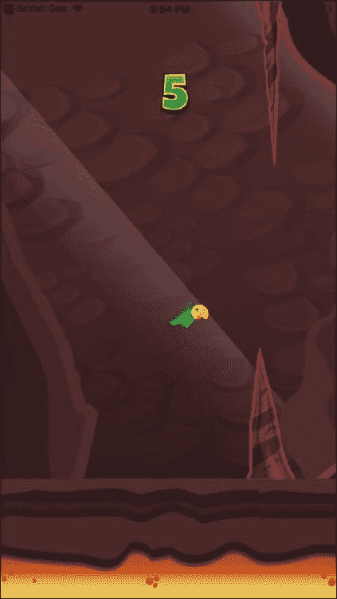

玩家必须帮助我们的鹦鹉飞过岩石。每次通过一组岩石，玩家将获得一分。

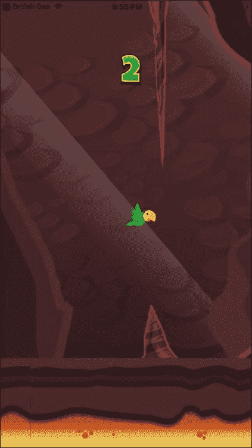

为了增加难度，岩石的高度将会变化，迫使鹦鹉飞得更高或更低以通过岩石。如果鹦鹉与岩石或地面发生碰撞，游戏将停止，并向用户呈现最终得分：

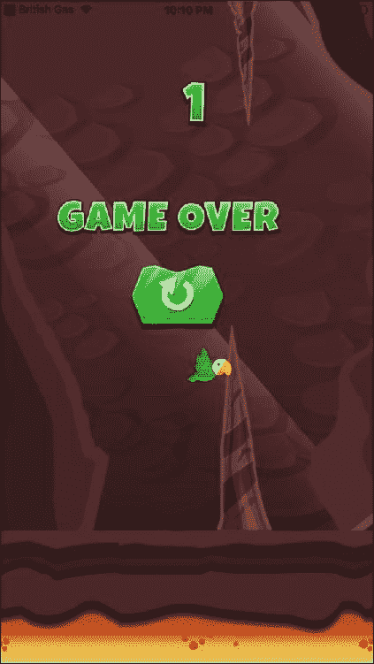

在这一点上，用户可以通过再次在屏幕上轻触来重新开始游戏。

为了使游戏更加美观和易玩，可以在屏幕的任何位置进行轻触，这将导致不同的效果，具体取决于用户所在的屏幕：

+   在初始屏幕上轻触将启动游戏

+   游戏中的轻触将导致鹦鹉飞得更高

+   在**游戏结束**屏幕上轻触将重新开始游戏并重置得分

正如可以观察到的那样，这将是一个非常简单的游戏，但正因为如此，它很容易扩展并且很有趣。在构建这种类型的应用程序时，一个重要的方面是拥有一套精美的图形。为此，我们将从多个游戏资产市场之一下载我们的资产，这些市场可以在线找到（大多数游戏资产需要支付一小笔费用，尽管偶尔也可以找到免费资产）。

这个游戏的技术挑战更多地在于精灵如何随时间移动，而不是在于复杂的状态维护。尽管如此，我们将使用 Redux 来保持和更新应用程序的状态，因为它是一个高性能且广为人知的解决方案。除了重新审视 Redux，我们还将在本课程中复习以下主题：

+   处理动画精灵

+   播放音效

+   检测碰撞的精灵

+   不同屏幕分辨率下的绝对定位

# 精灵

精灵是游戏中使用的图形，通常分组成一个或多个图像。许多游戏引擎包括工具来方便地拆分和管理这些图形，但在 React Native 中并非如此。由于它是设计用来处理不同类型的应用程序的，有几个库支持 React Native 处理精灵，但我们的游戏将足够简单，不需要使用这些库，所以我们将把一个图形存储在每个图像中，并将它们分别加载到应用程序中。

在开始构建游戏之前，让我们熟悉一下我们将加载的图形，因为它们将是整个应用程序的构建模块。

## 数字

我们将使用精灵来显示游戏中的得分，而不是使用`<Text/>`组件，以获得更吸引人的外观。这些是我们将用来表示用户得分的图像：

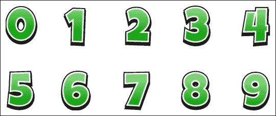

如前所述，所有这些图形将存储在单独的图像中（命名为`0.png`到`9.png`），因为 React Native 缺乏精灵拆分功能。

## 背景

我们需要一个大背景来确保它适合所有屏幕尺寸。在本课程中，我们将使用这个精灵作为静态图形，尽管它可以很容易地进行动画处理，以创建一个漂亮的视差效果：

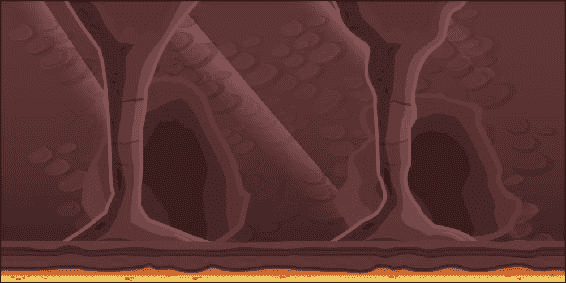

从这个背景中，我们将取一块地面来进行动画。

## 地面

地面将循环动画，以创建恒定的速度感。这个图像的大小需要大于我们想要支持的最大屏幕分辨率，因为它应该从屏幕的一侧移动到另一侧。在任何时候，将显示两个地面图像，一个接一个地确保在动画期间至少显示一个图像在屏幕上。

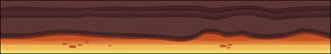

## 岩石

移动的岩石是我们的鹦鹉需要通过的障碍物。顶部和底部各有一个，并且两者将以与地面相同的速度进行动画处理。它们的高度将因每对岩石而异，但始终保持它们之间的间隙大小相同：

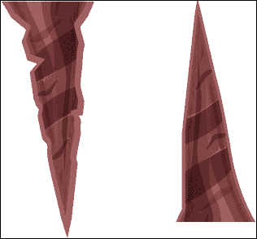

在我们的`images`文件夹中，我们将有`rock-up.png`和`rock-down.png`代表每个精灵。

## 鹦鹉

我们将使用两张不同的图像来表示我们的主角，这样我们就可以创建一个动画，显示用户何时点击了屏幕：

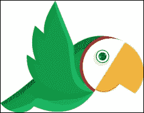

第一张图将在鹦鹉向下移动时显示：

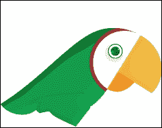

第二张图片将在用户按下屏幕使鹦鹉上升时显示。这些图片将被命名为`parrot1.png`和`parrot2.png`。

## 主屏幕

对于主屏幕，我们将显示两张图片：一个标志和一些关于如何开始游戏的说明。让我们来看看它们：

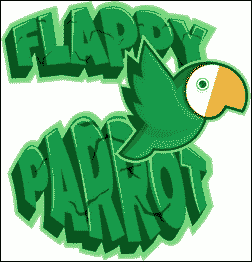

开始游戏的说明只是指出轻触将开始游戏：


## 游戏结束画面

当鹦鹉撞到岩石或地面时，游戏将结束。然后，是时候显示游戏结束标志和重置按钮，以重新开始游戏：


虽然整个屏幕都可以触摸以重新开始游戏，但我们将包括一个按钮，让用户知道轻触将导致游戏重新开始：


这张图片将被存储为`reset.png`。

这是我们游戏中将拥有的全部图片列表：

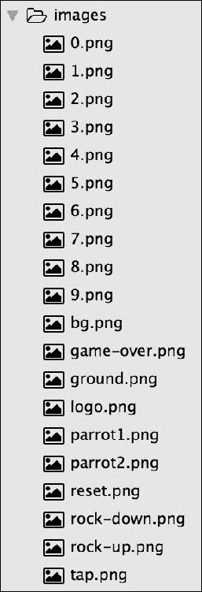

现在，我们知道了我们游戏中将使用的图片列表。让我们来看看整个文件夹结构。

# 设置文件夹结构

让我们使用 React Native 的 CLI 初始化一个 React Native 项目。该项目将命名为`birdGame`，并可用于 iOS 和 Android 设备：

```jsx
react-native init --version="0.46.4" birdGame
```

由于这是一个简单的游戏，我们只需要一个屏幕，我们将在其中定位所有我们的精灵，根据游戏状态移动、显示或隐藏它们，这将由 Redux 管理。因此，我们的文件夹结构将符合标准的 Redux 应用程序：

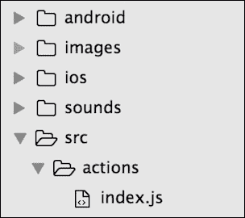

`actions`文件夹将只包含一个文件，因为在这个游戏中只会发生三个动作（`start`，`tick`和`bounce`）。还有一个`sounds`文件夹，用于存储每次鹦鹉通过一对岩石时播放的音效：

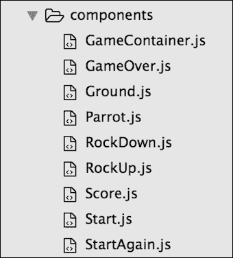

对于每个精灵，我们将创建一个组件，以便可以轻松地移动、显示或隐藏它：

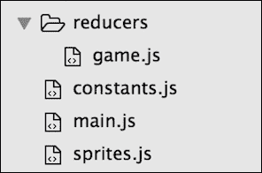

再次，只需要一个 reducer 来处理我们所有的动作。我们还将创建两个辅助文件：

+   `constants.js`：这是我们将存储用于分割播放游戏设备屏幕高度和宽度的辅助变量的地方。

+   `sprites.js`：这里存储了所有将计算精灵在每一帧中应该定位的函数，以创建所需的动画。

`main.js`将作为 iOS 和 Android 的入口点，并负责初始化 Redux：

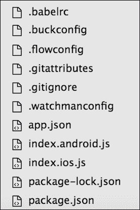

其余文件由 React Native 的 CLI 生成。

现在让我们来审查一下`package.json`文件，我们需要在项目中设置依赖项：

```jsx
/*** package.json ***/

{
  “name": “birdGame",
  “version": “0.0.1",
  “private": true,
  “scripts": {
    “start": “node node_modules/react-native/local-cli/cli.js start",
    “test": “jest"
  },
  “dependencies": {
    “react": “16.0.0-alpha.12",
    “react-native": “0.46.4",
    “react-native-sound": “⁰.10.3",
    “react-redux": “⁴.4.5",
    “redux": “³.5.2"
  },
  “devDependencies": {
    “babel-jest": “20.0.3",
    “babel-preset-react-native": “2.1.0",
    “jest": “20.0.4",
    “react-test-renderer": “16.0.0-alpha.12"
  },
  “jest": {
    “preset": “react-native"
  }
}
```

除了 Redux 库，我们还将导入`react-native-sound`，它将负责在我们的游戏中播放任何声音。

运行`npm install`后，我们的应用程序将准备好开始编码。与以前的应用程序一样，我们的消息应用的入口点将在`index.ios.js`和`index.android.js`中是相同的代码，但两者都将将初始化逻辑委托给`src/main.js`：

```jsx
/*** index.ios.js and index.android.js ***/ 

import { AppRegistry } from 'react-native';
import App from './src/main';

AppRegistry.registerComponent('birdGame', () => App);
```

`src/main.js`负责初始化 Redux，并将`GameContainer`设置为我们应用程序的根组件：

```jsx
/*** src/main.js ***/

import React from “react";
import { createStore, combineReducers } from “redux";
import { Provider } from “react-redux";

import gameReducer from “./reducers/game";
import GameContainer from “./components/GameContainer";

let store = createStore(combineReducers({ gameReducer }));

export default class App extends React.Component {
  render() {
    return (
      <Provider store={store}>
        <GameContainer />
      </Provider>
    );
  }
}
```

我们将`GameContainer`用作应用程序中组件树的根。作为常规的 Redux 应用程序，`<Provider />`组件负责向所有需要读取或修改应用程序状态的组件提供存储。

# GameContainer

`GameContainer`负责在用户点击屏幕后启动游戏。它将使用`requestAnimationFrame()`来实现这一点——这是 React Native 中实现的自定义定时器之一。

`requestAnimationFrame()`类似于`setTimeout()`，但前者会在所有帧刷新后触发，而后者会尽快触发（在 iPhone 5S 上每秒超过 1000 次）；因此，`requestAnimationFrame()`更适合处理动画游戏，因为它只处理帧。

与大多数动画游戏一样，我们需要创建一个循环来通过计算每个元素在每一帧上的下一个位置来为屏幕中的精灵创建动画。这个循环将由`GameContainer`内部的名为`nextFrame()`的函数创建：

```jsx
nextFrame() {
if (this.props.gameOver) return;
    var elapsedTime = new Date() - this.time;
    this.time = new Date();
    this.props.tick(elapsedTime);
this.animationFrameId = 
      requestAnimationFrame(this.nextFrame.bind(this));
}
```

如果属性`gameOver`设置为`true`，则此函数将被中止。否则，它将触发`tick()`动作（根据经过的时间计算精灵在下一帧上应该如何移动），最后通过`requestAnimationFrame()`调用自身。这将保持游戏中的循环以动画移动精灵。

当然，这个`nextFrame()`应该在第一次开始时被调用，所以我们还将在`GameContainer`内创建一个`start()`函数来启动游戏：

```jsx
start() {
cancelAnimationFrame(this.animationFrameId);
    this.props.start();
    this.props.bounce();
    this.time = new Date();
    this.setState({ gameOver: false });
this.animationFrameId = 
      requestAnimationFrame(this.nextFrame.bind(this));
}
```

`start`函数通过调用`cancelAnimationFrame()`确保没有启动任何动画。这将防止用户重置游戏时执行任何双重动画。

然后，这些函数触发`start()`动作，它只是在存储中设置一个标志，以通知游戏已经开始。

我们希望通过将鹦鹉向上移动来开始游戏，这样用户就有时间做出反应。为此，我们还调用`bounce()`动作。

最后，我们通过将已知的`nextFrame()`函数作为`requestAnimationFrame()`的回调来启动动画循环。

让我们也来审查一下我们将用于这个容器的`render()`方法：

```jsx
render() {
    const {
      rockUp,
      rockDown,
      ground,
      ground2,
      parrot,
      isStarted,
      gameOver,
      bounce,
      score
    } = this.props;

    return (
      <TouchableOpacity
onPress={
          !isStarted || gameOver ? this.start.bind(this) : 
            bounce.bind(this)
        }
        style={styles.screen}
activeOpacity={1}
      >
        <Image
          source={require(“../../images/bg.png")}
          style={[styles.screen, styles.image]}
        />
        <RockUp
          x={rockUp.position.x * W} //W is a responsiveness factor 
                                    //explained in the 'constants' section
          y={rockUp.position.y}
          height={rockUp.size.height}
          width={rockUp.size.width}
        />
        <Ground
          x={ground.position.x * W}
          y={ground.position.y}
          height={ground.size.height}
          width={ground.size.width}
        />
        <Ground
          x={ground2.position.x * W}
          y={ground2.position.y}
          height={ground2.size.height}
          width={ground2.size.width}
        />
        <RockDown
          x={rockDown.position.x * W}
          y={rockDown.position.y * H} //H is a responsiveness factor  
                                      //explained in the 'constants' 
                                      //section
          height={rockDown.size.height}
          width={rockDown.size.width}
        />
        <Parrot
          x={parrot.position.x * W}
          y={parrot.position.y * H}
          height={parrot.size.height}
          width={parrot.size.width}
        />
        <Score score={score} />
        {!isStarted && <Start />}
        {gameOver && <GameOver />}
        {gameOver && isStarted && <StartAgain />}
      </TouchableOpacity>
    );
  }
```

可能会很长，但实际上，它只是简单地将屏幕上所有可见元素进行定位，同时将它们包裹在`<TouchableOpacity />`组件中，以便捕捉用户在屏幕的任何部分点击。这个`<TouchableOpacity />`组件实际上在用户点击屏幕时不会向用户发送任何反馈（我们通过传递`activeOpacity={1}`作为属性来禁用它），因为这个反馈已经由鹦鹉在每次点击时反弹来提供。

### 注意

我们本可以使用 React Native 的`<TouchableWithoutFeedback />`来处理这个问题，但它有一些限制，这可能会影响我们的性能。

提供的`onPress`属性只是定义了用户在屏幕上点击时应用程序应该执行的操作：

+   如果游戏处于活动状态，它将使鹦鹉精灵反弹

+   如果用户在游戏结束画面上，它将通过调用`start()`动作重新启动游戏

`render()`方法中的所有其他子元素都是我们游戏中的图形元素，为每个元素指定它们的位置和大小。还有几点需要注意：

+   有两个`<Ground />`组件，因为我们需要在*x*轴上连续地对其进行动画处理。它们将水平排列在一起，以便一起进行动画处理，因此当第一个`<Ground />`组件的末端显示在屏幕上时，第二个的开头将跟随其后，从而创建连续感。

+   背景不包含在任何自定义组件中，而是包含在`<Image />`中。这是因为作为静态元素，它不需要任何特殊的逻辑。

+   一些位置被因子变量（`W`和`H`）相乘。我们将在常量部分更深入地研究这些变量。在这一点上，我们只需要知道它们是帮助绝对定位元素的变量，考虑到所有屏幕尺寸。

+   现在让我们将所有这些函数放在一起来构建我们的`<GameContainer />`：

```jsx
/*** src/components/GameContainer.js ***/

import React, { Component } from “react";
import { connect } from “react-redux";
import { bindActionCreators } from “redux";
import { TouchableOpacity, Image, StyleSheet } from “react-native";

import * as Actions from “../actions";
import { W, H } from “../constants";
import Parrot from “./Parrot";
import Ground from “./Ground";
import RockUp from “./RockUp";
import RockDown from “./RockDown";
import Score from “./Score";
import Start from “./Start";
import StartAgain from “./StartAgain";
import GameOver from “./GameOver";

class Game extends Component {
constructor() {
    super();
    this.animationFrameId = null;
    this.time = new Date();
  }

  nextFrame() {
     ...
  }

  start() {
     ...
  }

componentWillUpdate(nextProps, nextState) {
    if (nextProps.gameOver) {
      this.setState({ gameOver: true });
      cancelAnimationFrame(this.animationFrameId);
    }
  }

shouldComponentUpdate(nextProps, nextState) {
    return !nextState.gameOver;
  }

  render() {

     ...

  }
}

const styles = StyleSheet.create({
  screen: {
    flex: 1,
    alignSelf: “stretch",
    width: null
  },
  image: {
    resizeMode: “cover"
  }
});

function mapStateToProps(state) {
  const sprites = state.gameReducer.sprites;
  return {
parrot: sprites[0],
    rockUp: sprites[1],
    rockDown: sprites[2],
    gap: sprites[3],
    ground: sprites[4],
    ground2: sprites[5],
    score: state.gameReducer.score,
    gameOver: state.gameReducer.gameOver,
    isStarted: state.gameReducer.isStarted
  };
}
function mapStateActionsToProps(dispatch) {
  return bindActionCreators(Actions, dispatch);
}

export default connect(mapStateToProps, mapStateActionsToProps)(Game);
```

我们在这个组件中添加了另外三个 ES6 和 React 生命周期方法：

+   `super()`: 构造函数将保存一个名为`animationFrameId`的属性，以捕获`nextFrame`函数将运行的动画帧的 ID，还将保存另一个名为`time`的属性，该属性将存储游戏初始化的确切时间。`time`属性将被`tick()`函数用于计算精灵应该移动多少。

+   `componentWillUpdate()`: 每当传递新的 props（游戏中精灵的位置和大小）时，将调用此函数。它将检测游戏是否因碰撞而必须停止，因此游戏结束屏幕将被显示。

+   `shouldComponentUpdate()`: 这执行另一个检查，以避免在游戏结束时重新渲染游戏容器。

其余的函数与 Redux 相关。它们负责通过注入操作和属性将组件连接到存储中：

+   `mapStateToProps()`: 这会获取存储中所有精灵的数据，并将它们注入组件作为 props。精灵将被存储在一个数组中，因此它们将通过索引访问。除此之外，`Score`，一个标志表示当前游戏是否结束，以及一个标志表示游戏是否正在进行也将从状态中检索并注入到组件中。

+   `mapStateActionsToProps()`: 这将把三个可用操作（`tick`，`bounce`和`start`）注入到组件中，以便它们可以被使用。

### 注意

通过索引访问精灵数据并不是一种推荐的做法，因为如果精灵的数量增加，索引可能会发生变化，但出于简单起见，我们将在此应用中使用它。

# 操作

正如我们之前提到的，只有三个 Redux 操作将可用：

+   `tick()`: 计算屏幕上精灵的下一个位置

+   `bounce()`: 让鹦鹉向上飞

+   `start()`: 初始化游戏变量

这意味着我们的`src/actions/index.js`文件应该非常简单：

```jsx
/*** src/actions/index.js ***/

export function start() {
  return { type: “START" };
}

export function tick(elapsedTime) {
  return { type: “TICK", elapsedTime };
}

export function bounce() {
  return { type: “BOUNCE" };
}
```

只有`tick()`操作需要传递一个有效负载：自上一帧以来经过的时间。

# Reducer

由于我们有非常有限的行动，我们的减速器也会相当简单，并且会将大部分功能委托给`src/sprites.js`文件中的精灵助手函数：

```jsx
/*** src/reducers/index.js ***/

import {
  sprites,
  moveSprites,
  checkForCollision,
  getUpdatedScore,
  bounceParrot
} from “../sprites";

const initialState = {
  score: 0,
  gameOver: false,
  isStarted: false,
  sprites
};

export default (state = initialState, action) => {
  switch (action.type) {
    case “TICK":
      return {
        ...state,
        sprites: moveSprites(state.sprites, action.elapsedTime),
        gameOver: checkForCollision(state.sprites[0], 
        state.sprites.slice(1)),
        score: getUpdatedScore(state.sprites, state.score)
      };
    case “BOUNCE":
      return {
        ...state,
        sprites: bounceParrot(state.sprites)
      };
    case “START":
      return {
        ...initialState,
        isStarted: true
      };
    default:
      return state;
  }
};
```

`start()`函数只需要将`isStarted`标志设置为`true`，因为初始状态默认情况下将其设置为`false`。我们将在每次游戏结束时重用此初始状态。

`bounce()`将使用精灵模块中的`bounceParrot()`函数来为主角设置新的方向。

最重要的变化将发生在触发`tick()`函数时，因为它需要计算所有移动元素的位置（通过`moveSprites()`函数），检测鹦鹉是否与任何静态元素发生碰撞（通过`checkForCollision()`函数），并在存储中更新得分（通过`getUpdatedScore()`函数）。

正如我们所看到的，大部分游戏功能都委托给了精灵模块内的辅助函数，因此让我们更深入地看一下`src/sprites.js`文件。

# 精灵模块

精灵模块的结构由精灵数组和几个导出函数组成：

```jsx
/*** src/sprites.js ***/

import sound from “react-native-sound";

const coinSound = new sound(“coin.wav", sound.MAIN_BUNDLE);
let heightOfRockUp = 25;
let heightOfRockDown = 25;
let heightOfGap = 30;
let heightOfGround = 20;

export const sprites = [
   ...
];

function prepareNewRockSizes() {
  ...
}

function getRockProps(type) {
  ...
}

export function moveSprites(sprites, elapsedTime = 1000 / 60) {
  ...
}

export function bounceParrot(sprites) {
  ...
}

function hasCollided(mainSprite, sprite) {
  ...
}

export function checkForCollision(mainSprite, sprites) {
  ...
}

export function getUpdatedScore(sprites, score) {
  ...
}
```

该模块首先通过加载我们将在鹦鹉通过一组岩石时播放的音效来开始，以向用户反馈其得分增加。

然后，我们为几个精灵定义了一些高度：

+   `heightOfRockUp`：这是将出现在屏幕上部的岩石的高度。

+   `heightOfRockDown`：这是岩石的高度，将显示在屏幕的下部。

+   `heightOfGap`：我们将在上部和下部岩石之间创建一个不可见的视图，以侦测鹦鹉何时通过每组岩石，以便更新得分。这是间隙的高度。

+   `heightOfGround`：这是地面高度的静态值。

此模块中的每个其他项目都在移动或定位屏幕上的精灵。

## 精灵数组

这是负责在给定时间存储所有精灵位置和大小的数组。为什么我们使用数组来存储我们的精灵，而不是哈希映射（对象）？主要是为了可扩展性；虽然哈希映射会使我们的代码更易读，但如果我们想要添加新的现有类型的精灵（就像在这个应用程序中的`ground`精灵一样），我们需要为它们每个使用人工键，尽管它们是相同类型的。使用精灵数组是游戏开发中的一种常见模式，它允许将实现与精灵列表解耦。

每当我们想要移动一个精灵，我们将更新它在这个数组中的位置：

```jsx
export const sprites = [
  {

    type: “parrot",
    position: { x: 50, y: 55 },
    velocity: { x: 0, y: 0 },
    size: { width: 10, height: 8 }
  },
  {
    type: “rockUp",
    position: { x: 110, y: 0 },
    velocity: { x: -1, y: 0 },
    size: { width: 15, height: heightOfRockUp }
  },
  {
    type: “rockDown",
    position: { x: 110, y: heightOfRockUp + 30 },
    velocity: { x: -1, y: 0 },
    size: { width: 15, height: heightOfRockDown }
  },
  {
    type: “gap",
    position: { x: 110, y: heightOfRockUp },
    velocity: { x: -1, y: 0 },
    size: { width: 15, height: 30 }
  },
  {
    type: “ground",
    position: { x: 0, y: 80 },
    velocity: { x: -1, y: 0 },
    size: { width: 100, height: heightOfGround }
  },
  {
    type: “ground",
    position: { x: 100, y: 80 },
    velocity: { x: -1, y: 0 },
    size: { width: 100, height: heightOfGround }
  }
];
```

数组将存储游戏中所有移动精灵的定位和大小的初始值。

## prepareNewRockSizes()

这个函数随机计算下一个上部和下部岩石的大小以及它们之间间隙的高度：

```jsx
function prepareNewRockSizes() {
  heightOfRockUp = 10 + Math.floor(Math.random() * 40);
  heightOfRockDown = 50 - heightOfRockUp;
  heightOfGap = 30;
}
```

重要的是要注意，这个函数只计算新一组岩石的高度，但不创建它们。这只是一个准备步骤。

## getRockProps()

格式化岩石（或`gap`）的`position`和`size`属性的辅助函数：

```jsx
function getRockProps(type) {
  switch (type) {
    case “rockUp":
      return { y: 0, height: heightOfRockUp };
    case “rockDown":
      return { y: heightOfRockUp + heightOfGap, 
               height: heightOfRockDown };
    case “gap":
      return { y: heightOfRockUp, height: heightOfGap };
  }
}
```

## 移动精灵()

这是主要函数，因为它计算了存储在精灵数组中的每个精灵的新位置。游戏开发依赖于物理学来计算每帧中每个精灵的位置。

例如，如果我们想要将一个对象移动到屏幕的右侧，我们将需要更新它的`x`位置一定数量的像素。我们为对象的`x`属性添加的像素越多，下一帧它就移动得越快（`sprite.x = sprite.x + 5;`比`sprite.x = sprite.x + 1;`移动得快五倍）。

正如我们在下面的例子中所看到的，我们计算每个精灵的新位置的方式基于三个因素：精灵的当前位置，自上一帧以来经过的时间（`elapsedTime`），以及精灵的重力/速度（`即 sprite.velocity.y + elapsedTime * gravity`）。

此外，我们将使用辅助函数`getRockProps`来获取岩石的新大小和位置。让我们看看`moveSprites`函数是什么样子的：

```jsx
export function moveSprites(sprites, elapsedTime = 1000 / 60) {
  const gravity = 0.0001;
  let newSprites = [];

  sprites.forEach(sprite => {
    if (sprite.type === “parrot") {
      var newParrot = {
        ...sprite,
        position: {
          x: sprite.position.x,
          y:
            sprite.position.y +
            sprite.velocity.y * elapsedTime +
            0.5 * gravity * elapsedTime * elapsedTime
        },
        velocity: {
          x: sprite.velocity.x,
          y: sprite.velocity.y + elapsedTime * gravity
        }
      };
      newSprites.push(newParrot);
    } else if (
      sprite.type === “rockUp" ||
      sprite.type === “rockDown" ||
      sprite.type === “gap"
    ) {
      let rockPosition,
        rockSize = sprite.size;
      if (sprite.position.x > 0 - sprite.size.width) {
        rockPosition = {
          x: sprite.position.x + sprite.velocity.x,
          y: sprite.position.y
        };
      } else {
        rockPosition = { x: 100, y: getRockProps(sprite.type).y };
        rockSize = { width: 15, 
                     height: getRockProps(sprite.type).height };
      }
      var newRock = {
        ...sprite,
        position: rockPosition,
        size: rockSize
      };
      newSprites.push(newRock);
    } else if (sprite.type === “ground") {
      let groundPosition;
      if (sprite.position.x > -97) {
        groundPosition = { x: sprite.position.x + sprite.velocity.x,
                           y: 80 };
      } else {
        groundPosition = { x: 100, y: 80 };
      }
      var newGround = { ...sprite, position: groundPosition };
      newSprites.push(newGround);
    }
  });
  return newSprites;
}
```

计算精灵的下一个位置，大多数情况下是基本的加法（或减法）。例如，让我们看看鹦鹉应该如何移动：

```jsx
var newParrot = {
        ...sprite,
        position: {
          x: sprite.position.x,
          y:
            sprite.position.y +
            sprite.velocity.y * elapsedTime +
            0.5 * gravity * elapsedTime * elapsedTime
        },
        velocity: {
          x: sprite.velocity.x,
          y: sprite.velocity.y + elapsedTime * gravity
        }
     }
```

鹦鹉只会在垂直方向移动，其速度基于重力，因此`x`属性对它来说始终保持不变，而`y`属性将根据函数`sprite.position.y +` `sprite.velocity.y * elapsedTime +` `0.5 * gravity * elapsedTime * elapsedTime`进行改变，这个函数总结起来就是将经过的时间和重力分别加到不同的因素中。

岩石应该如何移动的计算要复杂一些，因为我们需要考虑每次岩石从屏幕上消失的情况（`if (sprite.position.x > 0 - sprite.size.width)`）。当它们被超过时，我们需要用不同的高度重新创建它们（`rockPosition = { x: 100, y: getRockProps(sprite.type).y }`）。

我们对地面也有相同的行为，需要在它完全离开屏幕时重新创建它（`if (sprite.position.x > -97)`）。

## 弹跳鹦鹉()

这个函数的唯一任务是改变主角的速度，这样它就会向上飞，逆转重力的影响。这个函数将在用户在游戏开始时点击屏幕时调用：

```jsx
export function bounceParrot(sprites) {
  var newSprites = [];
  var sprite = sprites[0];
  var newParrot = { ...sprite, velocity: { x: sprite.velocity.x,
                    y: -0.05 } };
  newSprites.push(newParrot);
  return newSprites.concat(sprites.slice(1));
}
```

这是一个简单的操作，我们从`sprites`数组中获取鹦鹉的精灵数据；我们将其在**y**轴上的速度更改为负值，以使鹦鹉向上移动。

## checkForCollision()

`checkForCollision()`负责识别任何刚性精灵是否与鹦鹉精灵发生了碰撞，以便游戏可以停止。它将使用`hasCollided()`作为一个支持函数，对每个特定的精灵执行所需的计算。

```jsx
function hasCollided(mainSprite, sprite) {
  /*** 
   *** we will check if 'mainSprite' has entered in the
   *** space occupied by 'sprite' by comparing their
   *** position, width and height 
   ***/

  var mainX = mainSprite.position.x;
  var mainY = mainSprite.position.y;
  var mainWidth = mainSprite.size.width;
  var mainHeight = mainSprite.size.height;

  var spriteX = sprite.position.x;
  var spriteY = sprite.position.y;
  var spriteWidth = sprite.size.width;
  var spriteHeight = sprite.size.height;

  /*** 
   *** this if statement checks if any border of mainSprite
   *** sits within the area covered by sprite 
   ***/

  if (
    mainX < spriteX + spriteWidth &&
    mainX + mainWidth > spriteX &&
    mainY < spriteY + spriteHeight &&
    mainHeight + mainY > spriteY
  ) {
    return true;
  }
}

export function checkForCollision(mainSprite, sprites) {
  /*** 
   *** loop through all sprites in the sprites array
   *** checking, for each of them, if there is a
   *** collision with the mainSprite (parrot)
   ***/

  return sprites.filter(sprite => sprite.type !== “gap").find(sprite => {
    return hasCollided(mainSprite, sprite);
  });
}
```

为了简单起见，我们假设所有精灵都是矩形的形状（尽管岩石朝末端变得更薄），因为如果考虑不同的形状，计算会更加复杂。

总之，`checkForCollision()`只是循环遍历`sprites`数组，以找到任何发生碰撞的精灵，`hasCollided()`根据精灵的大小和位置检查碰撞。在一个`if`语句中，我们比较了精灵和鹦鹉精灵的边界，以查看它们是否占据了屏幕相同的区域。

## getUpdatedScore()

精灵模块中的最后一个函数将检查分数是否需要根据鹦鹉位置相对于间隙位置（上下岩石之间的间隙也被视为一个精灵）进行更新：

```jsx
export function getUpdatedScore(sprites, score) {
  var parrot = sprites[0];
  var gap = sprites[3];

  var parrotXPostion = parrot.position.x;
  var gapXPosition = gap.position.x;
  var gapWidth = gap.size.width;

  if (parrotXPostion === gapXPosition + gapWidth) {
    coinSound.play();
    score++;
    prepareNewRockSizes();
  }

  return score;
}
```

一个`if`语句检查了鹦鹉在**x**轴上的位置是否超过了间隙（`gapXPosition + gapWidth`）。当这种情况发生时，我们通过调用其`play()`方法来播放我们在模块头部创建的声音（`const coinSound = new sound(“coin.wav", sound.MAIN_BUNDLE);`）。此外，我们将增加`score`变量，并准备一个新的岩石组在当前的岩石离开屏幕时渲染。

# 常量

我们已经看到了变量`W`和`H`。它们代表了屏幕的一部分，如果我们把它分成 100 部分。让我们看一下`constants.js`文件，以更好地理解这一点：

```jsx
/*** src/constants.js ***/

import { Dimensions } from “react-native";

var { width, height } = Dimensions.get(“window");

export const W = width / 100;
export const H = height / 100;
```

`W`可以通过将设备屏幕的总宽度除以`100`单位来计算（因为百分比在定位我们的精灵时更容易推理）。`H`也是如此；它可以通过将总高度除以`100`来计算。使用这两个常量，我们可以相对于屏幕的大小来定位和调整我们的精灵的大小，因此所有屏幕尺寸将显示相同的位置和大小比例。

这些常量将用于所有需要响应能力的视觉组件，因此它们将根据屏幕大小的不同显示和移动。这种技术将确保即使在小屏幕上，游戏也是可玩的，因为精灵将相应地调整大小。

现在让我们继续移动到将显示在`<GameContainer />`内的组件。

# 鹦鹉

主角将由这个组件表示，它将由`<GameContainer />`传递的`Y`位置属性驱动的两个不同的图像组成（翅膀上扬和下垂的相同鹦鹉）：

```jsx
/*** src/components/parrot.js ***/

import React from “react";
import { Image } from “react-native";
import { W, H } from “../constants";

export default class Parrot extends React.Component {
  constructor() {
    super();
    this.state = { wings: “down" };
  }

  componentWillUpdate(nextProps, nextState) {
    if (this.props.y < nextProps.y) {
      this.setState({ wings: “up" });
    } else if (this.props.y > nextProps.y) {
      this.setState({ wings: “down" });
    }
  }

  render() {
    let parrotImage;
    if (this.state.wings === “up") {
      parrotImage = require(“../../images/parrot1.png");
    } else {
      parrotImage = require(“../../images/parrot2.png");
    }
    return (
      <Image
        source={parrotImage}
        style={{
          position: “absolute",
          resizeMode: “contain",
          left: this.props.x,
          top: this.props.y,
          width: 12 * W,
          height: 12 * W
        }}
      />
    );
  }
}
```

我们使用一个名为`wings`的状态变量来选择鹦鹉将会是哪个形象--当它向上飞时，会显示翅膀下垂的形象，而向下飞时会显示翅膀上扬的形象。这将根据鸟在**y**轴上的位置来计算，该位置作为属性从容器传递过来：

+   如果`Y`位置低于先前的`Y`位置，意味着鸟正在下降，因此翅膀应该上扬

+   如果`Y`位置高于先前的`Y`位置，意味着鸟正在上升，因此翅膀应该下垂

鹦鹉的大小固定为`12 * W`，对于`height`和`width`都是如此，因为精灵是一个正方形，我们希望它相对于每个屏幕设备的宽度进行调整。

# RockUp 和 RockDown

岩石的精灵上没有逻辑，基本上是由父组件定位和调整大小的 `<Image />` 组件。这是 `<RockUp />` 的代码：

```jsx
/*** src/components/RockUp.js ***/

import React, { Component } from “react";
import { Image } from “react-native";

import { W, H } from “../constants";

export default class RockUp extends Component {
  render() {
    return (
      <Image
        resizeMode="stretch"
        source={require(“../../images/rock-down.png")}
        style={{
          position: “absolute",
          left: this.props.x,
          top: this.props.y,
          width: this.props.width * W,
          height: this.props.height * H
        }}
      />
    );
  }
}
```

高度和宽度将通过以下公式计算：`this.props.width * W` 和 `this.props.height * H`。这将使岩石相对于设备屏幕和提供的高度和宽度进行调整。

`<RockDown />` 的代码非常相似：

```jsx
/*** src/components/RockDown.js ***/

import React, { Component } from “react";
import { Image } from “react-native";

import { W, H } from “../constants";

export default class RockDown extends Component {
  render() {
    return (
      <Image
        resizeMode="stretch"
        source={require(“../../images/rock-up.png")}
        style={{
          position: “absolute",
          left: this.props.x,
          top: this.props.y,
          width: this.props.width * W,
          height: this.props.height * H
        }}
      />
    );
  }
}
```

# 地面

构建地面组件与岩石精灵类似。在正确的位置和大小渲染图像将足以满足此组件的需求：

```jsx
/*** src/components/Ground.js ***/

import React, { Component } from “react";
import { Image } from “react-native";

import { W, H } from “../constants";

export default class Ground extends Component {
  render() {
    return (
      <Image
        resizeMode="stretch"
        source={require(“../../images/ground.png")}
        style={{
          position: “absolute",
          left: this.props.x,
          top: this.props.y * H,
          width: this.props.width * W,
          height: this.props.height * H
        }}
      />
    );
  }
}
```

在这种情况下，我们将使用 `H` 来相对定位地面图像。

# 得分

我们决定使用数字图像来渲染分数，因此我们需要加载它们并根据用户的分数选择适当的数字：

```jsx
/*** src/components/Score.js ***/

import React, { Component } from “react";
import { View, Image } from “react-native";

import { W, H } from “../constants";

export default class Score extends Component {
getSource(num) {
    switch (num) {
      case “0":
        return require(“../../images/0.png");
      case “1":
        return require(“../../images/1.png");
      case “2":
        return require(“../../images/2.png");
      case “3":
        return require(“../../images/3.png");
      case “4":
        return require(“../../images/4.png");
      case “5":
        return require(“../../images/5.png");
      case “6":
        return require(“../../images/6.png");
      case “7":
        return require(“../../images/7.png");
      case “8":
        return require(“../../images/8.png");
      case “9":
        return require(“../../images/9.png");
      default:
        return require(“../../images/0.png");
    }
  }

  render() {
    var scoreString = this.props.score.toString();
    var scoreArray = [];
    for (var index = 0; index < scoreString.length; index++) {
      scoreArray.push(scoreString[index]);
    }

    return (
      <View
        style={{
          position: “absolute",
          left: 47 * W,
          top: 10 * H,
          flexDirection: “row"
        }}
      >
        {scoreArray.map(
          function(item, i) {
            return (
              <Image
                style={{ width: 10 * W }}
                key={i}
                resizeMode="contain"
                source={this.getSource(item)}
              />
            );
          }.bind(this)
        )}
      </View>
    );
  }
}
```

我们在 `render` 方法中进行以下操作：

+   将分数转换为字符串

+   将字符串转换为数字列表

+   使用支持的 `getSource()` 函数将数字列表转换为图像列表

React Native `<Image />` 的一个限制是其源不能作为变量被引入。因此，我们使用 `getSource()` 方法来检索源的小技巧，该方法实际上获取所有可能的图像，并通过 `switch`/`case` 子句返回正确的图像。

# 开始

开始屏幕包括两个图像：

+   一个标志

+   一个解释如何启动游戏的开始按钮（在屏幕上的任何位置轻触）

```jsx
/*** src/components/Start.js ***/

import React, { Component } from “react";
import { Text, View, StyleSheet, Image } from “react-native";

import { W, H } from “../constants";

export default class Start extends Component {
  render() {
    return (
      <View style={{ position: “absolute", left: 20 * W, top: 3 * H }}>
        <Image
          resizeMode="contain"
          source={require(“../../images/logo.png")}
          style={{ width: 60 * W }}
        />
        <Image
          resizeMode="contain"
          style={{ marginTop: 15, width: 60 * W }}
          source={require(“../../images/tap.png")}
        />
      </View>
    );
  }
}
```

我们再次使用我们的 `H` 和 `W` 常量，以确保元素在每个设备屏幕上都定位正确。

# 游戏结束

当鹦鹉与岩石或地面发生碰撞时，我们应该显示游戏结束画面。这个画面只包含两个图像：

+   游戏结束标志

+   重新开始游戏的按钮

让我们首先看一下游戏结束标志：

```jsx
/*** src/components/GameOver.js ***/

import React, { Component } from “react";
import { Image } from “react-native";

import { W, H } from “../constants";

export default class GameOver extends Component {
  render() {
    return (
      <Image
        style={{
          position: “absolute",
          left: 15 * W,
          top: 30 * H
        }}
        resizeMode="stretch"
        source={require(“../../images/game-over.png")}
      />
    );
  }
}
```

现在，让我们继续重置游戏按钮。

# 重新开始

实际上，重置按钮只是一个标志，因为用户不仅可以在按钮上轻触，还可以在屏幕的任何位置开始游戏。无论如何，我们将使用 *H* 和 *W* 常量在每个屏幕上正确定位此按钮：

```jsx
/*** src/components/StartAgain.js ***/

import React, { Component } from “react";
import { Text, View, StyleSheet, TouchableOpacity, Image } 
from “react-native";

import { W, H } from “../constants";

export default class StartAgain extends Component {
  render() {
    return (
      <Image
        style={{ position: “absolute", left: 35 * W, top: 40 * H }}
        resizeMode="contain"
        source={require(“../../images/reset.png")}
      />
    );
  }
}
```

# 总结

游戏是一种非常特殊的应用程序。它们基于根据时间和用户交互在屏幕上显示和移动精灵。这就是为什么我们在大部分课程中解释了如何以最高效的方式轻松显示所有图像以及如何定位和调整它们的大小。

我们还审查了一种常见的技巧，相对于设备屏幕的高度和宽度来定位和调整精灵的大小。

尽管 Redux 并非专门为游戏设计，但我们在应用程序中使用它来存储和分发精灵的数据。

总的来说，我们证明了 React Native 可以用于构建高性能的游戏，尽管它缺乏游戏特定的工具，但我们可以生成非常可读的代码，这意味着它应该很容易扩展和维护。事实上，在这个阶段可以创建一些非常简单的扩展来使游戏更有趣和可玩性：在通过特定数量的障碍物后增加速度，减少或增加间隙大小，在屏幕上显示多组岩石等等。

通过这个，我们已经完成了这次学习之旅。我希望你有一个顺利的旅程，并在 React 上获得了很多知识。

祝愿你在未来的项目中一切顺利。继续学习和探索！

# 评估

1.  命名游戏中使用的图形，通常分组为一个或多个图像。

1.  数字

1.  背景

1.  地面

1.  精灵

1.  请说明以下陈述是真还是假：精灵是游戏中使用的图形，通常分组为一个或多个图像。许多游戏引擎包括工具来方便地拆分和管理这些图形，但在 React Native 中并非如此。

1.  请说明以下陈述是真还是假：精灵数组是负责在特定时间存储所有精灵位置和大小的数组。

1.  哪些功能负责通过注入操作和属性将组件连接到存储中？

1.  ________ 负责在用户点击屏幕后启动游戏。它将使用`requestAnimationFrame()`来实现这一点——这是 React Native 中实现的自定义定时器之一。

1.  `nextFrame()`

1.  `cancelAnimationFrame()`

1.  `GameContainer`

1.  `mapStateToProps(state)`
